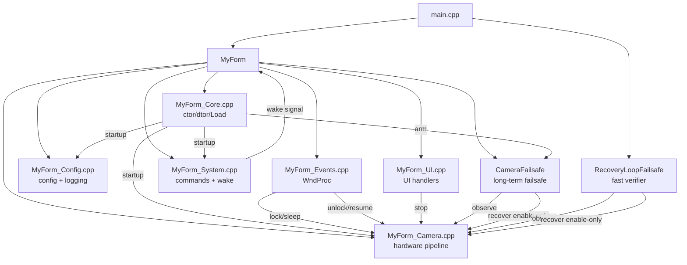
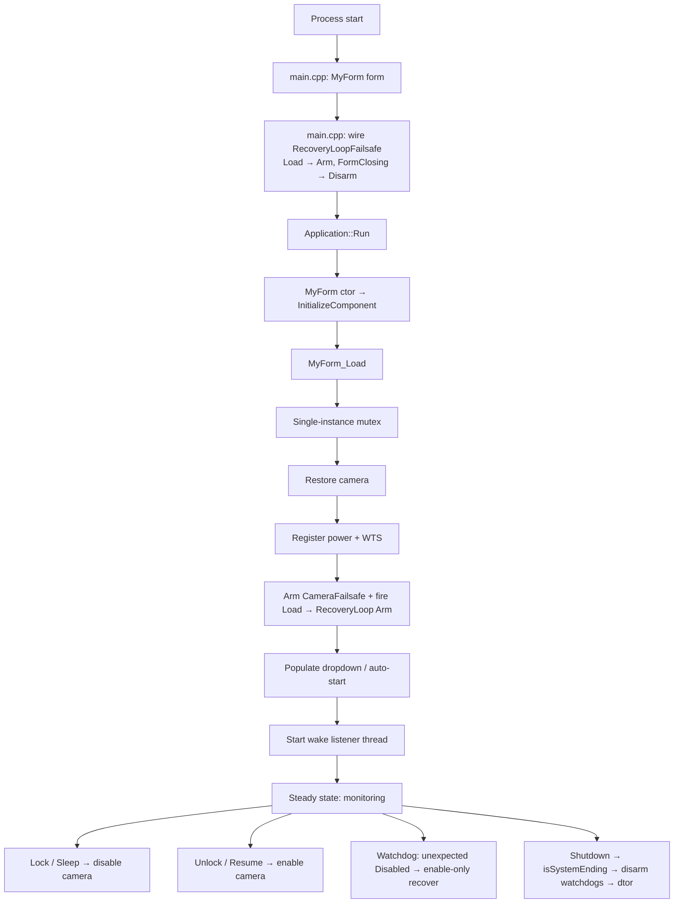
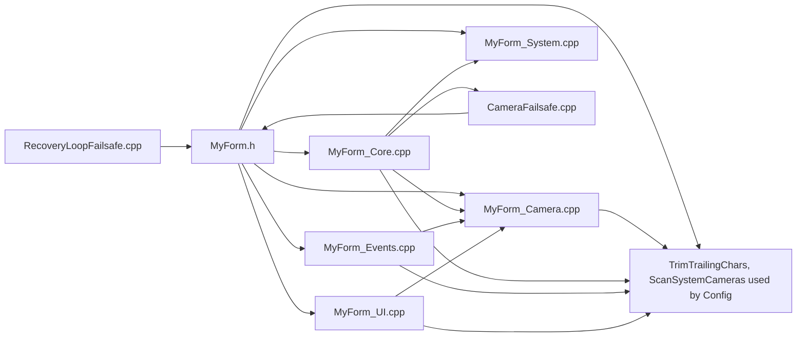
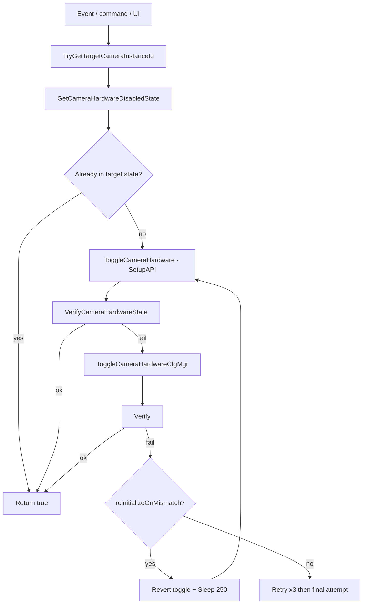

# Windows Hello Fix v2.1 — Architecture

> Documentation-only. Describes the **current** source under `src/core/` + `src/watchdog/` + `main.cpp`. No code was modified.

## Reference implementation relationship

```
reference/release-v2.0/MyForm.h  (monolith, known-good camera truth)
        │  mechanical extraction
        ▼
src/core/MyForm.h            declaration only (class, struct, globals `extern`)
src/core/MyForm_Camera.cpp   native camera pipeline + Disable/Enable/Restore members
src/core/MyForm_Config.cpp   config + diagnostic logging + target resolution
src/core/MyForm_Core.cpp     ctor / dtor / finalizer / InitializeComponent / MyForm_Load + failsafe accessors
src/core/MyForm_Events.cpp   WndProc (session / power / shutdown)
src/core/MyForm_System.cpp   command parsing + wake listener
src/core/MyForm_UI.cpp       FormClosing + btnToggle_Click
        │  later addition (failsafe work, outside src/core)
        ▼
src/watchdog/CameraFailsafe.*         long-term observe/recover (owned by MyForm)
src/watchdog/RecoveryLoopFailsafe.*   fast startup/poll/retry  (owned by main.cpp)
main.cpp                              entry + hidden launch + RecoveryLoopFailsafe wiring
```

The extraction kept **`MyForm` as the single, central state owner**. No `ApplicationController`, `CameraController`, `EventController`, or `RecoveryController` was introduced. Only member-function *bodies* moved into separate translation units; the class, its members, its lifetime, and its behavioral authority are unchanged from `release-v2.0/MyForm.h`.

The root `MyForm.h` is a 3-line shim:
```cpp
#pragma once
#include "src/core/MyForm.h"
```
This preserves the original `#include "MyForm.h"` path used by `main.cpp` without altering it.

## High-level architecture



> **Authority rule (load-bearing):** `D` (`MyForm_Camera.cpp`) is the only box that changes device state. `W` and `R` observe via `GetCameraHardwareDisabledState` and recover via `RecoverCameraHardware(target, false)` + `VerifyCameraHardwareState` — they contain no `SetupDi*`/`CM_*` device-state calls.

## Runtime lifecycle



## State ownership

| State | Owner |
|---|---|
| `isMonitoring` | `MyForm` |
| `isBackgroundMode`, `isSystemEnding` | `MyForm` |
| `cachedCameras`, `selectedInstanceId` (raw pointers) | `MyForm` (manual new/delete) |
| `cameraExpectedDisabled`, `cameraStateInitialized`, `restartQueuedByMismatch` | `MyForm` |
| `hAppMutex`, `hWakeupEvent` | `MyForm` |
| `hLidNotification`, `hButtonNotification` | `MyForm` |
| `backgroundWorker`, `keepListening` | `MyForm` |
| `deviceDrop`, `btnToggle`, `lblTitle`, `lblStatus`, `components` | `MyForm` (WinForms) |
| `diagnosticLogSync` | `MyForm` |
| `cameraFailsafe` (owned watchdog) | `MyForm` (created/armed in `MyForm_Load`, disarmed in dtor/finalizer) |
| `recoveryLoop` (fast verifier) | `main.cpp` (wired to `Load`/`FormClosing`, never for command workers) |
| `g_lastHardwareToggleTick`, `g_lastSetupApiError`, `g_lastConfigManagerResult`, `g_lastHardwareToggleStage` | Defined once in `MyForm_Camera.cpp`, `extern` elsewhere (single authoritative instance) |
| `config.txt`, `diagnostic.log` | Filesystem under `%APPDATA%\Windows Hello Fix` |

## Threading model

1. **UI thread** — message pump, `MyForm_Load`, `WndProc`, `btnToggle_Click`, `MyForm_FormClosing`, all camera members when invoked from UI/Load/WndProc, and **both watchdogs** (`CameraFailsafe` poll/verify timers, `RecoveryLoopFailsafe` startup/poll/retry timers — all `System::Windows::Forms::Timer`, all guarded by expected-state checks).
2. **Background wake listener** (`backgroundWorker`, `IsBackground=true`) — runs `ListenForWakeupSignal`, blocks on `WaitForSingleObject(hWakeupEvent)`. Only updates the window via `Invoke`; never touches camera hardware.

No thread pool, no task queue, no async camera operations. This matches the original v2.0 threading model; the watchdogs add timers on the existing pump, not threads.

## Dependency map



`MyForm.h` is the hub; every `.cpp` includes it. `MyForm_Camera.cpp` defines the shared globals and is the only place that calls SetupAPI/CfgMgr to change device state. `MyForm_Core.cpp` is the only core TU that includes a watchdog header (to construct/arm `CameraFailsafe`). `main.cpp` includes `RecoveryLoopFailsafe.h` and owns that instance; the watchdog `.cpp` files include `../core/MyForm.h` for the accessors and native pipeline declarations. Neither watchdog calls the other.

## Camera operation flow (high level)



## Windows APIs used (summary)

- **SetupAPI:** `SetupDiGetClassDevs`, `SetupDiEnumDeviceInfo`, `SetupDiGetDeviceInstanceId`, `SetupDiGetDeviceRegistryProperty`, `SetupDiSetClassInstallParams`, `SetupDiCallClassInstaller`, `SetupDiDestroyDeviceInfoList`.
- **Configuration Manager:** `CM_Get_DevNode_Status`, `CM_Enable_DevNode`, `CM_Disable_DevNode`, `CM_Reenumerate_DevNode`.
- **WTS:** `WTSRegisterSessionNotification`, `WTSUnRegisterSessionNotification`.
- **Power:** `RegisterPowerSettingNotification`, `UnregisterPowerSettingNotification`.
- **Sync/IPC:** `CreateMutex`, `OpenEvent`, `CreateEvent`, `SetEvent`, `WaitForSingleObject`, `GetTickCount64`, `Interlocked*`, `Sleep`.
- **Process:** `CreateProcess` family not used directly; `system("taskkill ...")` only in the ghost-reset path.
- **Token:** `OpenProcessToken`, `GetTokenInformation` (elevation/integrity, logging only).
- **WinForms:** `Application::Run`, `MessageBox`, `StreamWriter`/`StreamReader`, `Monitor`, `Invoke`.

See `docs/CAMERA_FLOW.md`, `docs/EVENT_FLOW.md`, `docs/LIFECYCLE.md`, `docs/DEBUGGING.md`, and `docs/KNOWN_ISSUES.md` for detail.
