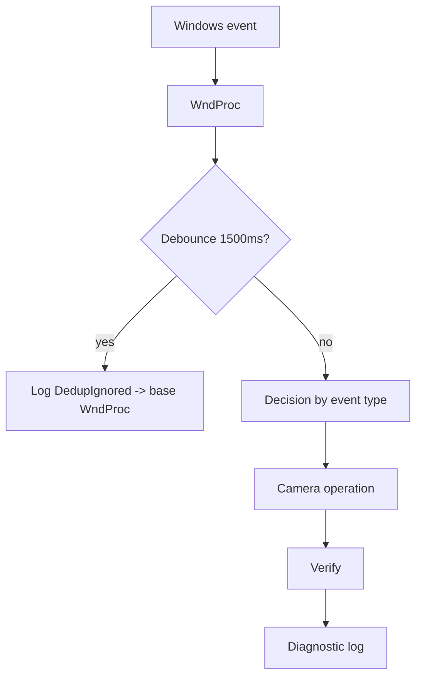

# Event Flow

All external events funnel through `MyForm::WndProc` (`src/ui/MyForm_Events.cpp`). The form must register for session notifications (`WTSRegisterSessionNotification`) and power notifications (`RegisterPowerSettingNotification`) during `MyForm_Load` for these events to arrive.



## Session lock

```
WM_WTSSESSION_CHANGE (WTS_SESSION_LOCK)
  -> (if isMonitoring) DisableTargetCameraHardware(true)
  -> VerifyCameraHardwareState
  -> WriteDiagnosticLog("SessionLock_Disable")
```

## Session unlock

```
WM_WTSSESSION_CHANGE (WTS_SESSION_UNLOCK)
  -> (if isMonitoring) EnableTargetCameraHardware(false)
  -> VerifyCameraHardwareState
  -> WriteDiagnosticLog("SessionUnlock_Enable")
```

## Suspend / lid close / power button

```
WM_POWERBROADCAST (0x0218) with wParam = 0x0004 (PBT_APMSUSPEND) or 0x8013 (PBT_POWERSETTINGCHANGE)
  -> if 0x8013 and GUID not lid/button: ignore (PowerSetting_IrrelevantGuid)
  -> if isMonitoring && !isAlreadyDisabled:
       isAlreadyDisabled = true
       DisableTargetCameraHardware(true)
       Sleep(500)
```

`isAlreadyDisabled` is a `static` in `WndProc`, ensuring the disable happens once per suspend even if multiple messages arrive.

## Resume

```
WM_POWERBROADCAST (0x0218) with wParam = 0x0007 (PBT_APMRESUMESUSPEND) or 0x0012 (PBT_APMRESUMEAUTOMATIC)
  -> if isMonitoring:
       Thread::Sleep(1000)   // let device tree rebuild
       EnableTargetCameraHardware(false)
       isAlreadyDisabled = false
```

## System shutdown / logoff

```
WM_QUERYENDSESSION (0x0011) or WM_ENDSESSION (0x0016)
  -> isSystemEnding = true
  -> if isMonitoring: DisableTargetCameraHardware(true)
  -> WTSUnRegisterSessionNotification
  (actual camera enable/disable-on-exit decided later in ~MyForm / !MyForm)
```

## Wake signal (cross-process)

```
Second instance starts -> OpenEvent(Global\WindowsHelloFix_WakeupEvent) -> SetEvent
  -> backgroundWorker (ListenForWakeupSignal) wakes
  -> BringWindowToFrontDelegate (Invoke to UI thread)
```

## Debounce constants

| Event class | State | Window |
|---|---|---|
| Power | `lastPowerEventCode`/`lastPowerEventTick` | 1500 ms |
| Session | `lastSessionEventCode`/`lastSessionEventTick` | 1500 ms |

If the same event code repeats within 1500 ms, it is logged as `*_DedupIgnored` and the base `Form::WndProc` is called without performing a camera operation.

## Exact values used

| Constant | Value | Use |
|---|---|---|
| `WM_POWERBROADCAST` | `0x0218` | power branch |
| `PBT_APMSUSPEND` | `0x0004` | suspend |
| `PBT_POWERSETTINGCHANGE` | `0x8013` | lid/button setting |
| `PBT_APMRESUMESUSPEND` | `0x0007` | resume |
| `PBT_APMRESUMEAUTOMATIC` | `0x0012` | resume automatic |
| `WM_WTSSESSION_CHANGE` | (from wtsapi32) | session branch |
| `WTS_SESSION_LOCK` / `WTS_SESSION_UNLOCK` | wtsapi32 constants | lock/unlock |
| `WM_QUERYENDSESSION` | `0x0011` | shutdown |
| `WM_ENDSESSION` | `0x0016` | shutdown |
| `Sleep(500)` | 500 ms | post-disable safety window |
| `Thread::Sleep(1000)` | 1000 ms | pre-enable resume delay |
