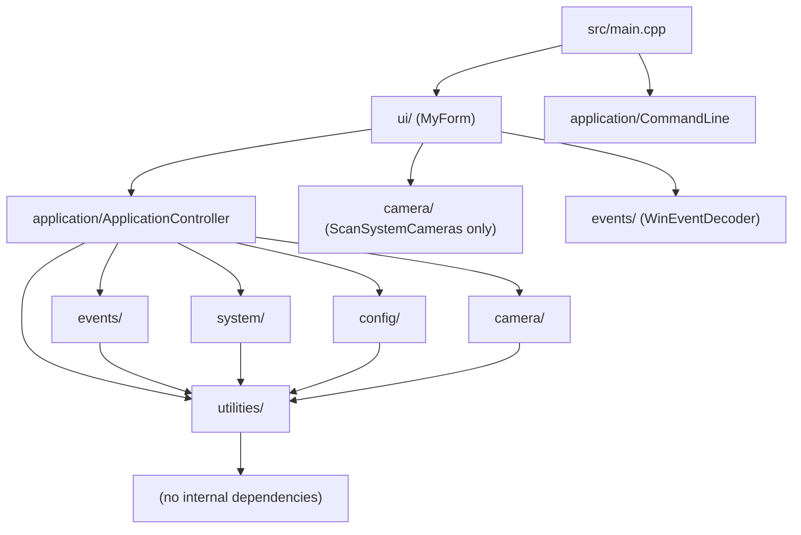
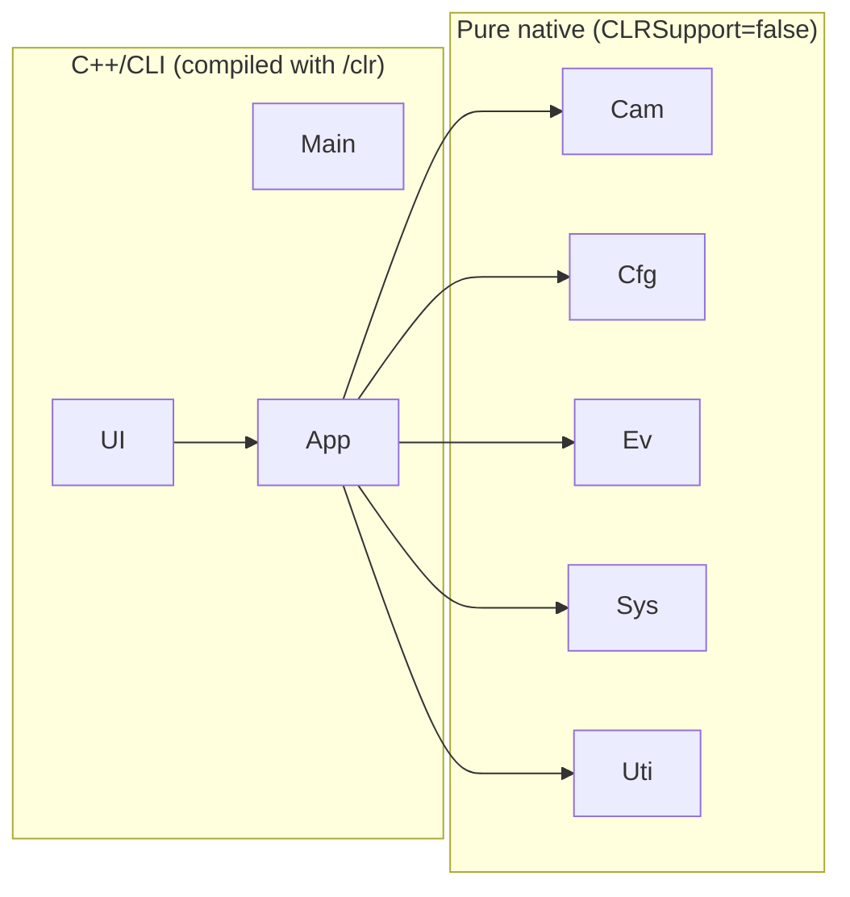
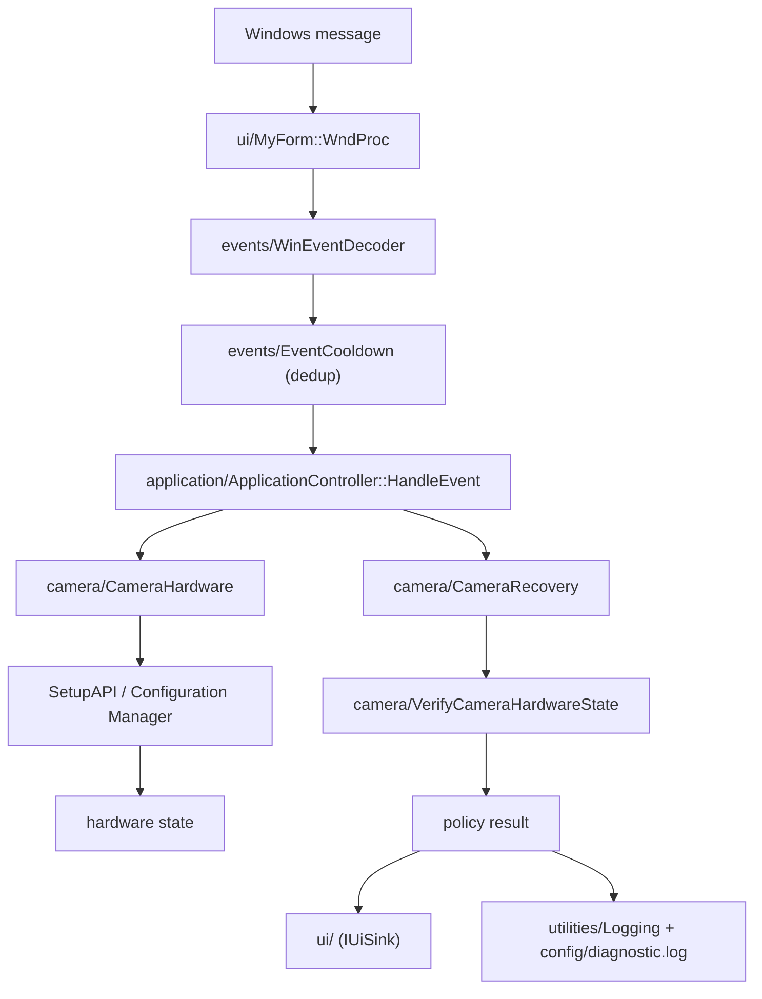

# Dependency Map

This document records the dependency relationships between the future v2.1
modules, derived from the actual coupling found in the v2.0 code.

## Module Dependency Graph (Target)

## The Managed/Native Boundary

The boundary rule:

> **Arrows only flow from managed → native. Never native → managed.**

This is what keeps the native core reusable, testable, and architecture-portable.

## Allowed Dependencies

| Module | May depend on |
|---|---|
| `utilities/` | nothing (dependency-free) |
| `config/` | `utilities/` |
| `system/` | `utilities/` |
| `events/` | `utilities/` |
| `camera/` | `utilities/`, `system/PrivilegeInfo` (optional, for elevation-aware logging) |
| `application/` | `camera/`, `config/`, `system/`, `events/`, `utilities/` |
| `ui/` | `application/`, `camera/` (scan only), `events/` (decode only) |
| `main.cpp` | `ui/`, `application/` |

## Discouraged Dependencies

- `ui/ → camera/` for anything beyond `ScanSystemCameras` (dropdown population).
  Hardware *policy* goes through `application/`.
- `ui/ → config/` directly; config reads/writes should be routed through
  `application/` so policy stays centralized.
- `camera/ → config/` (hardware must not know about storage paths).
- `events/ → camera/` (decoding must never trigger hardware).
- `events/ → application/` (no reverse policy dependency).
- Any module → `ui/` (presentation must be a leaf consumer).
- Any native module → managed types.

## Circular Dependencies to Eliminate

The v2.0 code contains latent circular coupling that the refactor must break:

1. **`ProductionUtilities.h` ⇄ `MyForm.h`.**
   `HardwareOperationQueue::ProcessOperations` was designed to be implemented in
   `MyForm.h` (the native hardware functions live there). The queue depends on
   functions defined in the form header.
   → *Fix:* move the hardware functions into `camera/`; the queue (if ever
   adopted) depends on `camera/CameraRecovery`, not on the form.
2. **WndProc ⇄ hardware.** Message handling and hardware calls are interleaved in
   one function.
   → *Fix:* `ui/` decodes via `events/` and delegates policy to
   `application/`, which calls `camera/`.
3. **UI ⇄ config.** Config functions are `MyForm` methods today.
   → *Fix:* extract to `config/`; the UI becomes a caller through
   `application/`.

## Data-Flow Dependency (Runtime)

## OS-Specific Boundaries

- **`system/`** is the home for all OS-primitive calls (token, mutex, event,
  process).
- **`camera/`** is the only module that talks to SetupAPI / Configuration
  Manager / the device registry.
- **`events/`** is the only module that interprets Win32 message values and GUIDs.
- **`ui/`** is the only module that owns an `HWND` (via the Form).
- These boundaries keep OS-specific knowledge from leaking across the codebase.

## UI/Business-Logic Boundary

- The UI knows **what** the user asked (start/stop monitoring, close window).
- The **application** module knows **what that means** (which hardware operations
  run, in what order, under which state gates).
- The **camera** module knows **how** to perform the hardware operation.
- `application/` communicates with the UI only through a narrow callback
  interface (`IUiSink`), so the controller never touches `Form` controls and the
  UI never embeds policy.

## Related Documents

- `overview.md` — principles and responsibility boundaries.
- `target-architecture.md` — per-module contracts.
- `data-flow.md` — runtime flows.
- `architecture-contract.md` — binding dependency rules.